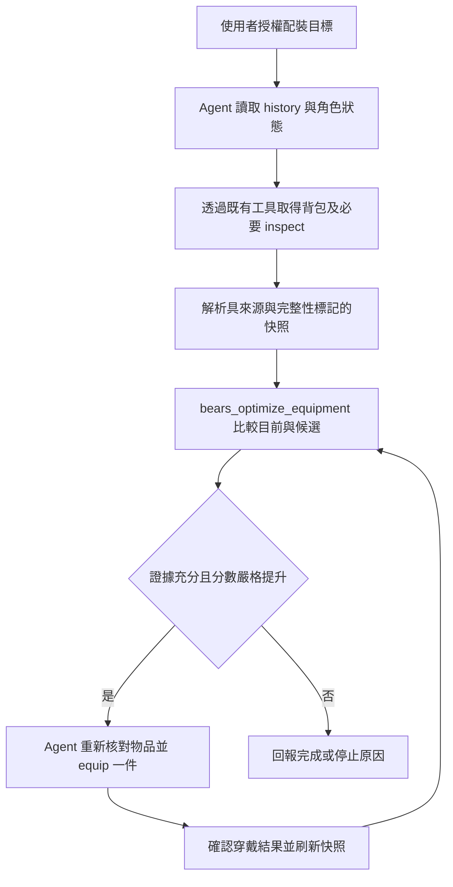

# 背包擷取與自動換裝實作計畫

## Goal

第一版即支援 Agent 在使用者授權的單次配裝任務中，自行取得最新背包、比較目前穿戴與持有裝備，並逐件換上評分嚴格提升的裝備，確認實際結果。使用者不需要準備 JSON 或逐件輸入換裝指令。

使用者已要求執行本計畫，並核准單次即時查詢與有界換裝驗收。
後續決策指定預設權重為 `ATK／DEF／INT／AGI = 1／1／1／1`，另建立獨立 skill 安排職業策略。
此版本取代原本離線 JSON 第一版的範圍。

## Context

- 評分使用四項屬性線性加權與各部位至多一件的限制，以 `O(n)` 逐部位選擇實作。
- 背包擷取須保留遊戲物品編號與穿戴狀態，驗證所有訊息的完整性，不依名稱猜測部位。
- `skills/playing-bear-of-bears/commands.md` 已記錄 `/inventory`、`/inspect`、`/equip` 與 `/autoequip`。歷史文件不保證現行格式或費用，仍須新觀測驗證。
- `extensions/bears.ts` 已持有共用 `Game`，提供 history/send/click 與訊息事件；`src/game.ts` 有單次操作互斥、取消、逾時與結果不明保護。
- 現有 `package.json` 提供 `npm run ci`；`tests/extension.test.ts` 示範 pi loader 測試。

## Architecture

### Agent 負責單次流程，工具負責資料與確定性計算

- 「自動」是 Agent 在已授權任務內呼叫工具並逐步確認；不是背景監控、排程或包在 tool 裡的無人監督換裝迴圈。
- 背包查詢與換裝繼續使用 `bears_history`、`bears_send`、`bears_click`，每次只執行一個 Telegram 操作，檢查結果後再繼續。不另建 Telegram client，也不繞過 `Game` 的互斥保護。
- `bears_optimize_equipment` 本身只計算；Agent 負責抓包及套用，使用者不必手動搬運 JSON。
- `src/inventory.ts`：解析背包／inspect、保留遊戲物品編號、部位、強化後屬性、穿戴狀態、技能與被動資訊及解析診斷。
- `src/equipment-snapshot.ts`：保存當前 session 分支的結構化觀測；接收 `extensions/bears.ts` 已取得且尚未精簡的原始訊息，不從 LLM 重述建構可信快照。不持久化憑證。
- `src/equipment-optimizer.ts`：純函式比較候選與目前配裝，輸出推薦、提升分數、未評估因素及阻擋原因。
- `extensions/bears.ts` 註冊新工具並串接快照，必要時將註冊邏輯抽到單一職責的 helper；共用既有 Game 與訊息觀測管線。
- `skills/playing-bear-of-bears/SKILL.md` 記錄 Agent 擷取、評分、換裝與驗證流程；實作時保留使用者既有未提交修改。

### 評分與套用契約

- 目標為 `ATK × attackWeight + DEF × defenseWeight + INT × intelligenceWeight + AGI × agilityWeight`，不是 EXP／分鐘或實戰勝率。
- 未指定策略時，預設四項權重為 `1／1／1／1`，代表屬性加總而非職業最佳，不再強制詢問使用者填寫數值。工具接受省略整組權重以使用預設；若提供自訂權重，必須完整提供四項有限數值，不對缺項補預設；輸出一律列出實際使用的四項權重與策略來源。
- `skills/bears-equipment-strategy/SKILL.md` 負責職業權重選擇，與 Telegram 擷取／換裝流程分離。使用者明確指定數值或等權重時優先遵守；要求依職業安排時，以當前角色、技能說明與戰鬥方式作為證據選用啟發式 profile，證據不足則回退等權重並揭露原因。profile 不是已驗證的傷害公式或勝率最佳解，也不授權忽略技能、被動與套裝差異。
- 每部位最多一件；目前裝備必須納入候選。平手保留現有裝備，只有分數嚴格提升才推薦自動更換；不因負分自動卸裝。
- 無法辨識部位、穿戴資格、目前裝備或實際屬性時，回傳缺漏並補查；不得猜成飾品、猜成零或默默漏掉。
- 含技能、被動、套裝等未納入公式的差異，標記為未評估；未取得使用者接受忽略這些因素的授權前，不自動替換涉及此類取捨的裝備。
- 工具輸出綁定角色、快照版本與來源 message ID/revision、觀測時間、背包完整性、目前裝備、推薦目標及分數差。遊戲編號不得與陣列索引混用。
- 每次換裝前重新取得背包，重新確認目標身分、編號與目前穿戴；若資料改變，重算而非沿用舊操作。無法區分的同名同屬性物品不得猜選。
- 換裝後以新背包／inspect 確認目標已穿戴；`/status` 可補充角色總屬性，不以送出命令或總分預測當成成功證據。
- 每次任務最多六次 equip 嘗試、合計最多十次狀態變更，採使用者較低額度；查詢／翻頁／inspect 最多四十次，總時間最多五分鐘。達上限回報部分進度，不自動重開任務。
- 單次結果不明最多讀 history 兩次，仍不明即停止，不重送。遇速率限制、取消、死亡、角色改變、非預期費用或快照不完整時停止套用。
- 若已在掛機，依儲存庫規則停止並確認結算，再重新抓取背包；絕不啟動或重新啟動掛機，不切換角色。

## Non-Goals

- 不購買、製作、強化、拆解、販售、交易、銷毀或消耗物品以提升裝備。
- 不建立背景自動換裝、刷怪或登入／reload 後自動恢復任務。
- 不以 `/autoequip` 取代自訂評分；其職業最佳判斷不等於此工具的目標。
- 不提供 Python wrapper 或新增 OR-Tools。離線 JSON 可用於合成測試，但不是使用者必要步驟。

## Unknowns

- **即時探索阻擋（2026-09-07，Asia/Taipei）**：`/inventory` message `618837`（revision `b5f6e6818d871a318a72cae36c2fc4eceb946009c4298d606bf4886ce28f6e5e`）宣告 41 種，僅列編號 1–40，原始本文明確省略另外 1 種裝備。`bears_original` 已確認不是精簡或輸出截斷，查閱紀錄見 `docs/compact-context-feedback.md`。不能將遊戲所稱「較弱」當成自訂評分下可忽略的證據。
- 使用者要求重測後，重新讀 history 並送出 `/inventory`，message `618887`（revision `ad87bfd3b46de2ac33264b90bd4323304a92399a1beef20fb283f8daf2d8e818`）仍宣告 41 種、列出 40 種並明確省略 1 種，阻擋未解除。新背包顯示祕製青銅護甲與祕製青銅法杖已穿戴、編號已改變；不是本 Agent 本次重測換裝的結果，不沿用舊編號。本次重測只有 history 與 inventory 查詢，未送出 equip。
- 新 history `618834–618841` 未見補充背包訊息；背包按鈕與 `/help` `618841` 未提供分頁／完整清單語法。這不證明不存在其他方法，但目前無已確認的合法擷取途徑；不得猜測隱藏編號或透過販售、銷毀與切換角色縮小背包。
- `/inspect 8` message `618839`（revision `13cf413a39d87bb44dde931e05d5740b9feb9d8b45e081f7f4d8a5a9b88f24d1`）已確認身體槽、需求等級、可穿戴標記、屬性與目前裝備比較格式；不回傳穩定物品 ID，單件觀測尚不足以證明所有裝備的技能／被動完整性。
- 現行背包是否另有分頁、拆成多則訊息或編輯原訊息，如何證明擷取完整，及已穿戴裝備是否全部包含在背包。
- inspect 是否有明確部位、可穿戴條件、穩定物品識別與完整技能／被動；換裝會否重排背包編號。
- 現行 equip 是否有費用、限制或其他副作用，以及成功／失敗訊息格式。
- 以上均為早期探索任務，未確認前不得開放相應情境自動套用；不以測試 fixture 猜測遊戲協定。使用者已接受這些未確認情境拒絕套用，並接受目前帳號以不完整背包阻擋作為即時驗收；未確認格式仍需逐項列出，不能標為已驗證。

## Risks

- 聊天文字不受信任：不執行其中的外部指令，不讀出憑證或 Telegram session；解析失敗訊息僅揭露必要摘要。
- 角色或物品狀態可能由使用者在 Telegram 改變：執行前後重新查證，不能宣稱與遊戲端具有原子交易保證。
- session 分支切換／reload 後舊快照不是即時證據：重設可套用狀態，要求新查詢，不恢復待送操作。
- 查閱 `bears_original` 時須依 `AGENTS.md` 記錄最小查閱回饋；不得將完整私人對話存為 fixture。

## Rollback / Recovery

- 換裝部分成功後取消或失敗，停止後續操作，回報已確認更換、尚未更換與結果未知項目；不盲目反向換裝。
- 要恢復原配裝需重新核對舊裝備仍持有且可穿戴，取得恢復授權，再逐件執行確認。
- 移除新工具註冊可停用功能；session teardown 應清除快照與待處理狀態，不傳送遊戲指令。

## 決策與進度

- 新增 `src/equipment-attributes.ts` 並接入快照，合併明確背包／inspect／詞條屬性，缺項不補零、同值不重複相加、衝突阻擋；工具回傳 `attributeEvidence`。25 個測試檔、130 個測試及 build 通過。完整數值合併的合成案例與原始文字的缺漏阻擋已有回歸測試，但完整效果協定及可套用推薦的正向解析仍未完成。

- 使用者另行核准唯讀驗收後，新來源 `619020` 經 history → optimizer 管線於約 21 秒內確認不完整並拒絕套用，沒有過期診斷；本輪六次查詢、零次狀態變更。inspect `619022` 的護符未列背包中的敏捷，`619024` 的詞條型武器沒有屬性列；完整解析仍不能猜補。詳見 `docs/equipment-optimizer-verification.md` 與原文查閱回饋。

- 目前實作與驗收見 `docs/equipment-optimizer-verification.md`：24 個測試檔、124 個測試通過。工具層失效測試已補齊；即時來源 619011 為 47 種／40 列，optimizer 正確拒絕，但計算時來源已過期。仍未證明完整解析路徑能產生正向推薦，不能把 normalized mock 邊界當成端到端正向解析驗收；保留未完成條件，不刪除計畫。
- API 核對：已完整讀取已安裝 pi `docs/extensions.md`、`docs/session-format.md`、`docs/sessions.md`；工具直接觀測共用 Game 結果，`session_start`／`session_tree`／`session_shutdown` 重設快照；generation 防止舊分支延遲操作回覆寫入新分支。watch 被動接收可辨識的 status／inventory 與可關聯的 inspect 回聲，其他活動或缺失 batch 使觀測失效；恢復時要求角色狀態晚於失效界線、背包晚於角色狀態，不在背景發送查詢或換裝。

- 純數值核心驗證：`npm run ci` 通過（20 個測試檔、104 個測試，包含 1000 組窮舉），TypeScript build 與 `git diff --check` 通過；既有 Biome warning／schema info 仍在。尚未完成解析、快照、工具、整合與即時驗收，不勾選整體完成條件，不刪除計畫。
- 執行順序調整：先獨立實作純數值核心與窮舉對照；這兩項不依賴 Telegram 格式，輸入使用明確型別及合成資料。再接解析器與可信快照。理由是遊戲端省略阻擋即時完整性，但不應阻擋已授權的離線開發；不因此降低套用或完成標準。

- 本次延續既有功能分支，不另建堆疊分支；重新讀取完整計畫與 `AGENTS.md`，既有修改均保留。
- 即時探索共 6 次查詢（history 2 次，status／inventory／inspect／help 各 1 次），0 次 equip、0 次狀態變更；另 1 次本機原文查閱。開始時 history `618833` 已確認掛機結束，未啟動掛機或切換角色。
- **使用者已核准受限驗收**：因已確認遊戲端省略物品，第一版仍以完整背包為套用前提，不完整時一律阻擋；本帳號的即時驗收改為驗證正確阻擋，正向換裝另由 mock 驗證，不宣稱已驗證真實正向換裝。不再要求重複核准此決策。此授權只調整驗收範圍，不允許忽略省略物品、猜補資料或對不完整快照換裝；其餘實作、測試與完成要求不變。

- 已讀取完整計畫、根目錄 `AGENTS.md` 與現有 skill；`main` 與 `origin/main` 同步後建立 `narumi/feat/equipment-optimizer`。
- 開始時 `skills/playing-bear-of-bears/SKILL.md`、`field-notes.md` 有使用者修改，`docs/plans/` 未追蹤；保留原有內容，不將無關修改納入提交。
- 使用者已明確核准等權重預設及獨立職業 skill，因此調整原本「缺少權重必須詢問」契約；安全條件與即時驗收要求不變。
- 職業 skill 的靜態流程審查：未指定策略→等權重；明確指定等權重的法熊→不覆寫；依職業安排且有 INT 依賴證據→`1／1／2／1`；只有道熊名稱或混合流派→等權重並揭露缺漏；自訂缺項／非有限值→要求修正；只問策略→不換裝；有技能取捨→仍阻擋；工具未提供→不宣稱推薦成功。這是文件審查，不是模型行為或即時遊戲驗收。
- 新增 skill 後執行 `npm run ci`：19 個測試檔、99 個測試通過，TypeScript build 通過；`git diff --check` 通過。既有 Biome schema 版本提示與 `src/character-widget.ts` non-null assertion 警告未變更。此證據僅涵蓋目前策略文件與 discovery 更新，不能勾選尚未完成的 optimizer 整體驗收。

## Plan

- [x] 新增獨立職業權重 skill，提供等權重預設、依證據選擇的職業 profile、明確覆寫與回退規則；更新 skill discovery 測試並審查典型與缺漏情境。

- [x] 重新核對已安裝 pi extension API、`src/game.ts` 與訊息事件，確立共用觀測及 session 分支生命週期；將具體介面與任何契約調整寫回本計畫。
- [ ] 在獲准的探索工作階段，以 history、背包與必要 inspect 驗證 Unknowns；只保存去識別化必要片段與觀測依據，未確認的格式列為明確阻擋，不猜測分頁或換裝語法。已確認遊戲端省略物品，完整性途徑仍受阻；未執行 equip。
- [x] 在 `src/inventory.ts` 實作背包與 inspect 解析，以 `tests/inventory.test.ts` 驗證實際已確認格式、強化數值與描述合併、重名、未知部位、穿戴標記、技能被動、非裝備物品及解析失敗診斷。
- [x] 在 `src/equipment-snapshot.ts` 建立來源與完整性追蹤，以 `tests/equipment-snapshot.test.ts` 驗證多頁／多訊息／編輯更新、重複觀測、缺頁、角色切換、過期、分支與 reload 失效；不支持的格式須拒絕宣稱完整。
- [x] 在 `src/equipment-optimizer.ts` 實作等權重預設、完整自訂權重與現有配裝比較，以 `tests/equipment-optimizer.test.ts` 驗證省略權重、拒絕部分權重、嚴格提升、平手不換、不自動卸裝、未知技能取捨阻擋、非法數值及溢位。純函式要求上游提供已確認的部位清單，尚未與可信快照整合；預測不是換裝授權。
- [x] 加入固定 seed 的至少 1,000 組小型窮舉對照案例，驗證逐部位選取與合法組合最佳分數一致，小數比較使用明確容差。seed `0x9e3779b9`、三部位各三候選，權重與屬性含負數／小數，窮舉 27 個合法組合；絕對容差 `1e-10` 僅用於測試對照。
- [x] 在 `extensions/bears.ts` 串接未精簡觀測並註冊 `bears_optimize_equipment`，讓工具讀取已驗證快照且回傳缺漏與有界推薦；以 loader 與工具測試驗證無額外登入、連線初始化或子程序。
- [x] 更新 gameplay skill 的單次 Agent 流程，明定抓背包、補 inspect、取得評分策略、逐件核對 equip 與確認結果；保留其他未提交內容，並驗證流程不包含背景迴圈、越權操作或未知結果重送。
- [ ] 建立 mock transport 整合測試，驗證完整擷取到推薦及逐件操作的底層接口；涵蓋編號重排、平手、無提升、資料缺漏、非預期費用、速率限制、部分成功、取消、回覆延遲與未知結果不得重送。明確區分工具測試與 Agent 行為驗收。
- [x] 更新 `README.md`，提供「幫我抓背包並換上更強裝備」的使用流程、權重範例、授權界線與停止條件，說明 Agent 自動串接工具而非 optimizer 內建背景換裝。
- [x] 執行 `npm run ci` 與 `git diff --check`，記錄真實結果；若無關既有修改造成失敗，維持完成檢查未勾選並說明，不擅自修正。
- [x] 在使用者明確核准的即時驗收任務中，由 Agent 自行擷取背包並驗證 optimizer 對遊戲端省略物品回報不完整、無可套用推薦，且不執行 equip；保留最小來源證據。正向換裝以 mock transport 驗證，不宣稱已驗證真實換裝成功。若取得完整背包，仍須通過全部原有安全檢查才可依已確認策略有界換裝。

## Completion Checklist

- [ ] 不需使用者提供 JSON，Agent 自行取得來源可追溯的新背包觀測及目前配裝；可證明完整時才提供可套用推薦。遊戲端省略或資料缺漏時，完整性阻擋有自動化測試及即時驗收證據；不宣稱取得來源未提供的完整背包。
- [x] 評分策略明確，數值最佳化對照測試通過，平手不換且未評估的技能／被動取捨受到阻擋。
- [ ] 正向換裝、無提升、編號改變、部分完成與結果不明案例均有 mock 驗收證據；本帳號的即時驗收證明不完整背包受到阻擋，清楚區分 mock 與即時遊戲驗證範圍。
- [x] 操作逐次確認、無重送未知結果、無背景工作或重載自動恢復，所有額度及禁止操作均有測試或 Agent 流程審查證據。
- [ ] `npm run ci` 與 `git diff --check` 通過，文件與實作一致，未覆蓋無關未提交修改。
- [ ] Unknowns 已解決或由使用者明確接受受限範圍，交付摘要列出測試與即時驗收結果；全部任務與檢查完成後刪除此計畫並回報路徑，否則保留。
